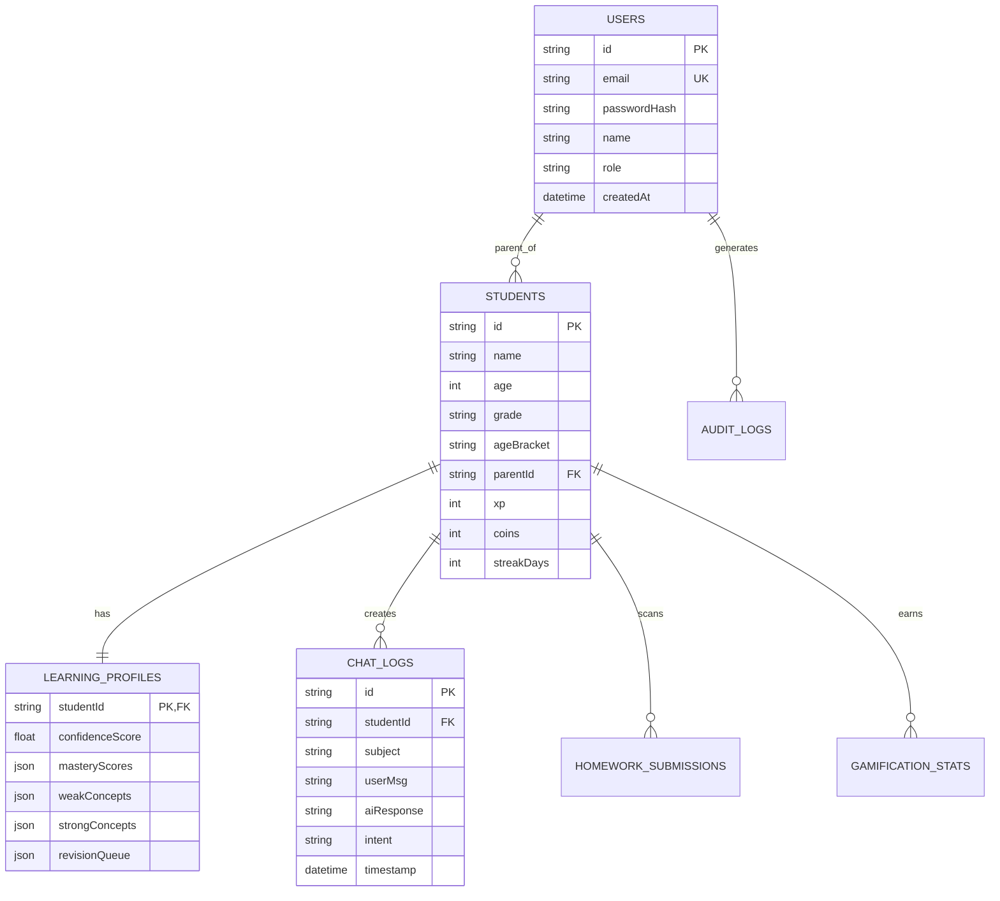

# EduVerse AI Kids — Enterprise Architecture & Technical Documentation

## 1. Executive Summary

**EduVerse AI Kids** is a production-grade, Socratic AI tutoring platform designed specifically for children aged 4–12 years. Combining design inspiration from Duolingo, Khan Academy Kids, Disney, and OpenAI, the platform ensures children learn through inquiry, guided exploration, and interactive problem solving—never receiving direct answers, but developing critical thinking skills.

---

## 2. System Architecture

```mermaid
graph TD
    Client[Browser Frontend / PWA] --> API[Express REST API Gateway]
    API --> Auth[JWT & RBAC Security Layer]
    API --> DB[(SQLite / PostgreSQL Database)]
    API --> Orchestrator[21-Stage AI Orchestrator]
    
    Orchestrator --> Agents[Specialized AI Agents Registry]
    Agents --> MathAgent[Math Socratic Agent]
    Agents --> ScienceAgent[Science Explorer]
    Agents --> EnglishAgent[Grammar Coach]
    Agents --> ReadingAgent[Phonics & Reading]
    Agents --> SpaceAgent[Cosmic Voyager]
    
    Orchestrator --> Abstraction[Multi-Provider AI Abstraction Layer]
    Abstraction --> Gemini[Google Gemini API (Default)]
    Abstraction --> Groq[Groq Engine]
    Abstraction --> OpenRouter[OpenRouter]
    Abstraction --> Ollama[Ollama Local Engine]
    Abstraction --> Fallback[Client & Server Socratic Engine]
    
    Orchestrator --> Safety[Child-Safe Moderation & Safety Engine]
    Orchestrator --> Formatters[Voice / SSML / Quiz Formatters]
```

---

## 3. The 21-Stage AI Orchestrator Pipeline

Every student prompt passes through a strict 21-stage pipeline before a response is returned to the child:

1. **Request Validation**: Validates payload structure, sanitizes input text, checks rate limits.
2. **Intent Detection**: Classifies request (`question`, `need_hint`, `concept_explanation`, `story`, `quiz`).
3. **Age Bracket Normalizer**: Maps student age (4–6, 7–9, 10–12) to language complexity rules.
4. **Learning Profile Query**: Retrieves student confidence score and concept mastery records.
5. **Memory Engine**: Fetches recent chat history context to maintain continuous dialogue.
6. **Difficulty Engine**: Adjusts Socratic hint depth based on historical performance.
7. **Socratic Prompt Building**: Enforces Non-Direct Answer Policy and constructs 3-level hint ladders.
8. **AI Agent Router**: Selects specialized agent (`math`, `science`, `english`, `reading`, `space`, `story`, `homework`).
9. **Provider Router**: Determines active provider (`gemini`, `groq`, `openrouter`, `openai`, `ollama`).
10. **Provider Execution**: Invokes provider REST API or built-in Socratic Fallback Engine.
11. **Response Validation**: Ensures response is non-empty and formatted correctly.
12. **Safety Engine**: Scans text against Child-Safety & Positive Reinforcement rules.
13. **Quiz Generator Integration**: Attaches optional 10 XP micro-quiz challenge.
14. **Animation & Emoji Engine**: Embeds mascot emojis (`🤖`, `🚀`, `🧮`, `🌟`).
15. **Voice Formatter**: Formats text for Web Speech API and generates SSML tags.
16. **XP & Gamification Calculation**: Calculates XP rewards for asking thoughtful questions.
17. **Parent Audit Logging**: Logs interaction for Parent & Teacher dashboard insights.
18. **Concept Tagging**: Tags target concepts (e.g. `7x Multiplication Table`, `Fractions`).
19. **Response Assembly**: Combines answer, hints, confidence score, and mascot metadata.
20. **Security Header Injection**: Adds CORS and anti-tamper security signatures.
21. **Client Delivery**: Delivers JSON payload to frontend UI.

---

## 4. Multi-Provider AI Abstraction Layer

The platform features a zero-lock-in provider abstraction layer:
- **Google Gemini API**: Configured as default dev/production engine via `GEMINI_API_KEY`.
- **Groq API**: High-speed inference fallback.
- **OpenRouter / Ollama**: Open-weights models and local offline execution.
- **Intelligent Socratic Fallback Engine**: Built-in, zero-dependency offline Socratic AI engine ensuring 100% platform availability even without internet or external API keys.

---

## 5. Normalized Relational Database Schema



---

## 6. Authentication & Role-Based Access Control (RBAC)

| Role | Access Permissions | Demo Credentials |
|---|---|---|
| **Student** | Socratic Chat Tutor, Voice Tutor, Story Studio, Quiz Arena, Homework OCR, Gamification | `student@eduverse.ai` / `student123` |
| **Parent** | Parent Analytics Dashboard, Weekly Progress Reports, Screen Time Controls | `parent@eduverse.ai` / `parent123` |
| **Teacher** | Classroom Roster, AI Printable Worksheet Generator, Student Performance | `teacher@eduverse.ai` / `teacher123` |
| **Admin** | System Health Monitor, Audit Logs, Database Management, Provider Switcher | `admin@eduverse.ai` / `admin123` |

---

## 7. API Reference Specification

### Authentication
- `POST /api/auth/register` — Register a new account
- `POST /api/auth/login` — Sign in and receive JWT token
- `GET /api/auth/me` — Verify session and fetch profile

### AI Orchestrator & Agents
- `POST /api/ai/chat` — Submit Socratic question to AI Agent
- `POST /api/ai/voice` — Process speech transcript and return SSML TTS prompt
- `POST /api/ai/homework-scan` — Analyze worksheet image and return 3-step hint ladder
- `POST /api/ai/generate-story` — Generate interactive story by theme
- `POST /api/ai/generate-quiz` — Fetch adaptive quiz challenge

### Dashboards & Gamification
- `GET /api/parent/analytics` — Retrieve weekly study hours and mastery progress
- `POST /api/teacher/worksheets` — Generate printable AI worksheet
- `GET /api/teacher/students` — Retrieve classroom roster
- `GET /api/gamification/stats` — Fetch current XP, coins, and streak
- `POST /api/gamification/award` — Award XP and coins for completed activities

---

## 8. Deployment & Execution Guide

### Local Development
```bash
# 1. Install Dependencies
npm install

# 2. Run Test Suite
npm test

# 3. Start Production Server
npm start
```
Server runs at: `http://localhost:3000`
